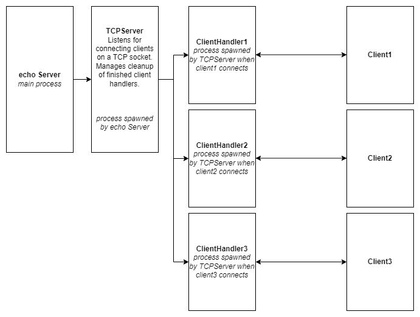

# TCP Echo Server and Client

## Architecture
- tcp_server: Library of members and methods used to setup and run a TCP server.
- tcp_client: Library of members and methods used to setup and run a TCP client.
- server: provides a handler to handle incoming TCP connections passed from the tcp_server
- client: uses the tcp_client library to create a TCP connection and send data to the echo server



## Usage
To run the project, use the following commands:
1. Compile all the files using the makefile to get the server and client binaries **echos** and **echo** respectively.
```bash
make
```
2. Open a terminal and run the TCP server on a port number.
```bash
./echos <port number>
```
3. Open a new terminal and run the TCP client on the same port number. Provide an IPv4 or IPv6 address as well.
```bash
./echo <IP Address> <port number>
```
4. Repeat step 3 in order to create new clients and connect to the server.

## Contribution
- Caleb: Architecture and code for the TCP server and client libraries and main files.
- Rishabh: Improvements to the code for TCP server and client libraries and test cases.