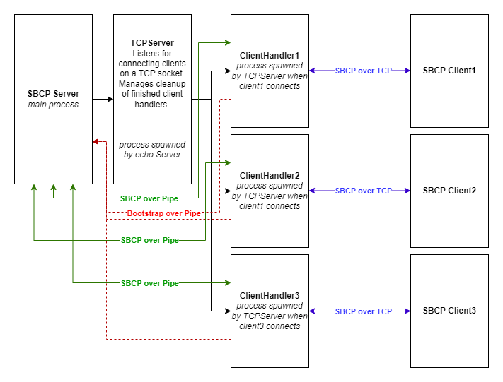

# Simple Broadcast Chat Server

## Custom libraries

### libtcp
based on TCP server and client implementation from MP1. Extended with a few extra capabilities (like binding to specific IP address)

### libsbcp
- sbcp: holds all base definitions for the SBCP protocol datastructures, helpful functions, and accessor datastructures... useful for making raw SBCP messages
- messages: Helpers for creating SBCP messages that conform to the SPCP server/client interaction

## Main programs
- sbcp_client: sbcp client implementation
- sbcp_server: sbcp server implementation



## Usage
To run the project, use the following commands:
1. Compile all the files using the makefile to get the server and client binaries **server** and **client** respectively.
```bash
make
```
2. Open a terminal and run the TCP server on a port number.
```bash
./server <ip address> <port number> <max clients>
```
3. Open a new terminal and run the TCP client on the same port number. Provide an IPv4 or IPv6 address as well.
```bash
./client <username> <IP Address> <port number>
```
4. Repeat step 3 in order to create new clients and connect to the server.

## Contribution
- Caleb: Architecture and code for the SBCP server and client libraries and main files.
- Rishabh: Improvements to the code for SBCP server and client libraries and test cases.


# Sbcp Elixir

**TODO: Add description**

## Installation

If [available in Hex](https://hex.pm/docs/publish), the package can be installed
by adding `sbcp` to your list of dependencies in `mix.exs`:

```elixir
def deps do
  [
    {:sbcp, "~> 0.1.0"}
  ]
end
```

Documentation can be generated with [ExDoc](https://github.com/elixir-lang/ex_doc)
and published on [HexDocs](https://hexdocs.pm). Once published, the docs can
be found at <https://hexdocs.pm/sbcp>.

## Usage

To run the project, use the following commands:
```bash
mix client <username>
```

